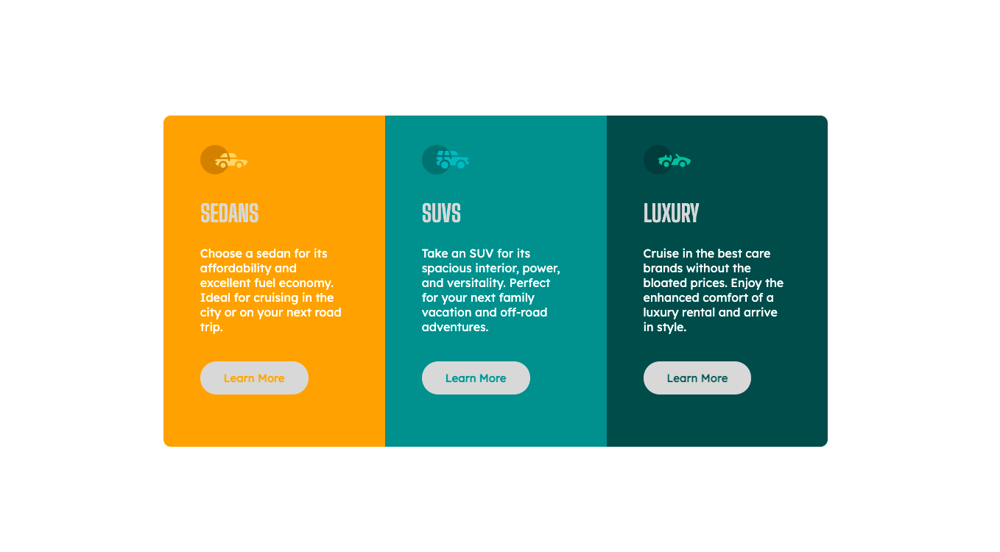

# Frontend Mentor - 3-column preview card component solution

This is a solution to the [3-column preview card component challenge on Frontend Mentor](https://www.frontendmentor.io/challenges/3column-preview-card-component-pH92eAR2-). Frontend Mentor challenges help you improve your coding skills by building realistic projects.

## Table of contents

- [Overview](#overview)
  - [The challenge](#the-challenge)
  - [Screenshot](#screenshot)
  - [Links](#links)
- [My process](#my-process)
  - [Built with](#built-with)
  - [What I learned](#what-i-learned)
  - [Useful resources](#useful-resources)
- [Author](#author)
- [Acknowledgments](#acknowledgments)

## Overview

### The challenge

Users should be able to:

- View the optimal layout depending on their device's screen size
- See hover states for interactive elements

### Screenshot

Add a screenshot of your solution. The easiest way to do this is to use Firefox to view your project, right-click the page and select "Take a Screenshot". You can choose either a full-height screenshot or a cropped one based on how long the page is. If it's very long, it might be best to crop it.

Alternatively, you can use a tool like [FireShot](https://getfireshot.com/) to take the screenshot. FireShot has a free option, so you don't need to purchase it.

Then crop/optimize/edit your image however you like, add it to your project, and update the file path in the image above.

### Links

- Solution URL: [Add solution URL here](https://your-solution-url.com)
- Live Site URL: [Add live site URL here](https://ohounsi.github.io/Frontend-Mentor-Challenge/)

## My process

### Built with

- Semantic HTML5 markup
- CSS custom properties
- CSS Grid

### What I learned

On this project I learnt how to position div elements side by side in multiple ways, which include: Grid display; using the hide comments between div statements in HTML; manipulating the position properties etc.

I also learnt from Jeanette Watts @JeanetteW how to manipulate certain properties within a div in CSS without having to create a class or id for the said properties.

### Useful resources

- https://coder-coder.com/display-divs-side-by-side/) - This is an amazing article which helped me understand how to position div elements beside each other. I'd recommend it to anyone still learning this concept.

## Author

- Website - [Michael Enearu](https://www.your-site.com)
- Frontend Mentor - [@Ohounsi](https://www.frontendmentor.io/profile/yourusername)
- Twitter - [@Ohounsi](https://www.twitter.com/yourusername)

## Acknowledgments

I would like to thank Jeanette Watts from the Frontend Mentor community, her solution gave me a lot of inspiration in solving my own code issues.
